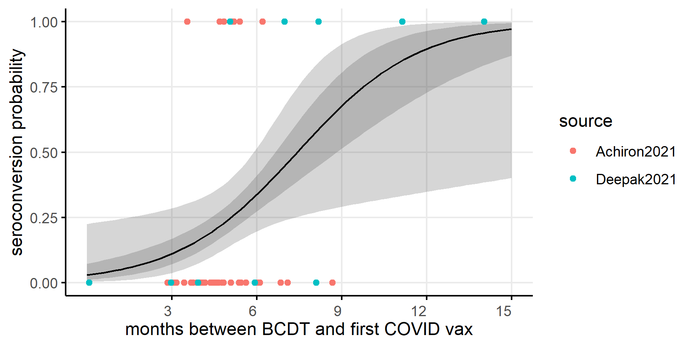
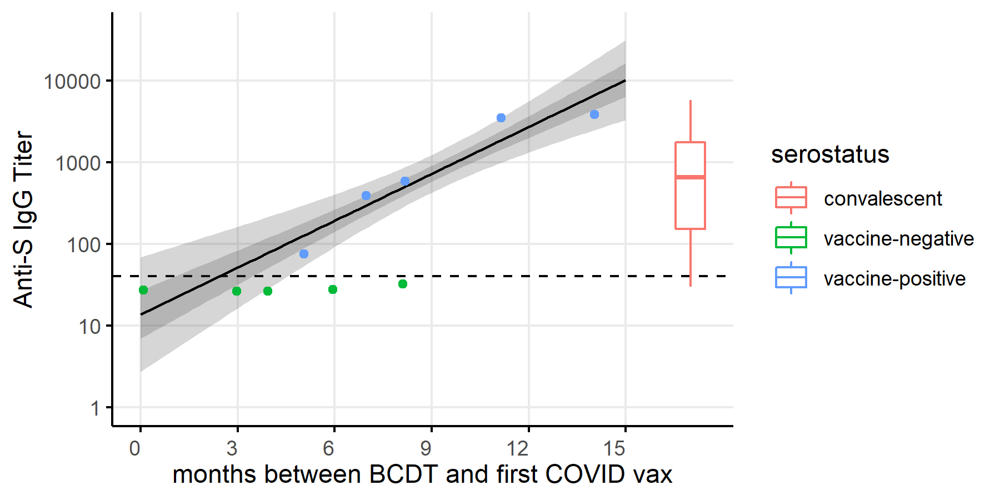
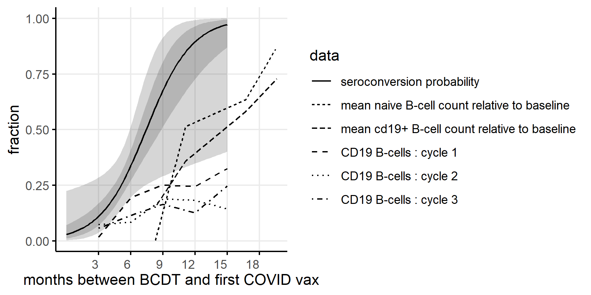
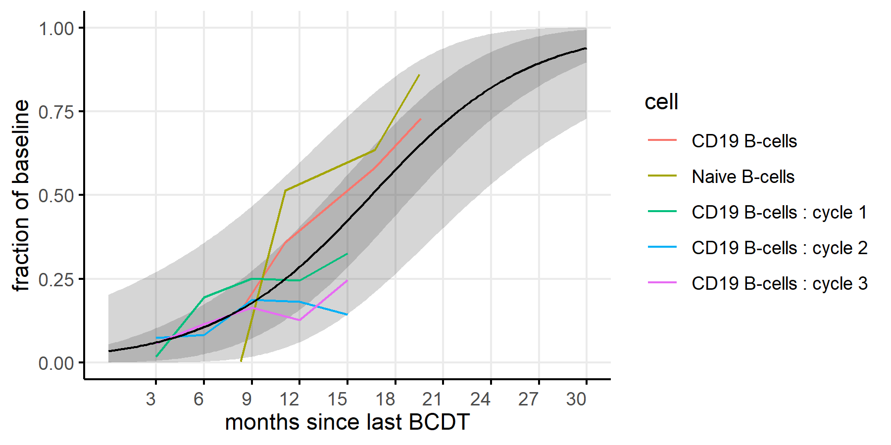
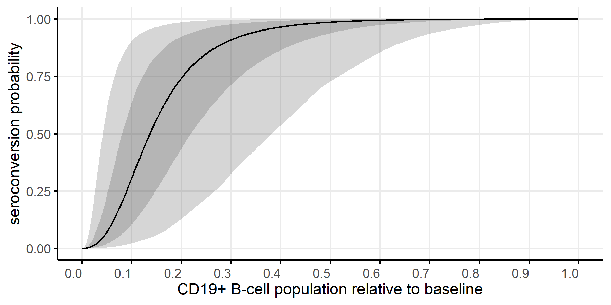

# Seroconversion after COVID-19 vaccination in patients using B-cell depleting therapies to manage multiple sclerosis increases with time between treatment and vaccination.

Mike Famulare

v0.2 03 June 2021

## Abstract
B-cell depleting therapies (BCDT) such as ocrelizumab and rituximab used for the management of multiple sclerosis are associated with reduced seroconversion rates following COVID-19 vaccination.  In this note, I reanalyze data from the literature to examine how the probability of seroconversion depends on the time interval between the last BCDT dose and the first vaccine dose. While uncertainty is high due to limited data, the results show that the seroconversion probability increases with time. Under a Bayesian interpretation of logistic regression, I estimate with 80% confidence that it requires at least 9 months from last BCDT to first vaccination to have a >50% chance of seroconversion following complete mRNA vaccination, with large uncertainty on when higher confidence of seroconversion can be expected. Among subjects who do seroconvert following vaccination, anti-Spike IgG levels correlate with time since last BCDT. Limited data indicate that levels comparable with immunocompetent response can be achieved with intervals of 12 or more months between BCDT and vaccination. With combined data from multiple sources, I argue that time development of the seroconversion probability and antibody response parallels that of CD19+ and naive B-cell repopulation following BCDT, suggesting that monitoring B-cell repopulation will be useful at the individual level for optimizing vaccine response while maintaining adequate MS control.

## Introduction

## Methods
Data on seroresponse following COVID-19 vaccination (Pfizer-BioNTech BNT162b2) were digitized for analysis from [Achiron et al 2021](https://journals.sagepub.com/doi/10.1177/17562864211012835) and [Deepak et al 2021](https://www.medrxiv.org/content/10.1101/2021.04.05.21254656v2) using the [WebPlotDigitizer from Ankit Rohatgi](https://automeris.io/WebPlotDigitizer/citation.html). More information is available in the relevant data files and analysis script at [github.com/famulare/covid-vax-response-vs_time_since_bcdt](https://github.com/famulare/covid-vax-response-vs_time_since_bcdt). As best as I can tell from the primary sources, all time intervals span from the most recent b-cell depleting therapy (BCDT) dose and the first of two COVID-19 vaccinations. I combined data from both studies without adjustment as no significant factors were found to distinguish the datasets beyond the time interval (not shown).

Data on anti-Spike IgG from convalescent sera using the same assay as Deepak et al 2021 was digitized from [Turner et al 2021](https://www.nature.com/articles/s41586-021-03647-4). Comparison to convalescent plasma is useful for standardizing antibody measures to model expected vaccine efficacy, as described in [Khoury et al 2021](https://www.nature.com/articles/s41591-021-01377-8) and [Cohen et al 2021](https://www.medrxiv.org/content/10.1101/2021.05.31.21258018v1).  

Data on b-cell repopulation over time following BCDT was taken from [Baker et al 2020](https://www.authorea.com/users/334776/articles/461938-covid-19-vaccine-readiness-for-ocrelizumab-and-other-anti-cd20-depleting-therapies-in-multiple-sclerosis-and-other-autoimmune-diseases). 

Logistic regression (Binomial regression with logit link) was used to model the dependence of the seroconversion probability with time between the most recent BCDT and first vaccinations. The fractional mean B-cell population size relative to baseline was modeled as a beta regression with logit link. And the dependence of antibody levels with time for subjects who do seroconvert was modeled with standard linear regression for log(neutralization titer) vs time.  To ease discussion, I interpret all models in a Bayesian sense, where implicitly flat uninformative priors have been assumed for all parameters.  All model figures show the max aposteriori estimate with 80% and 95% credible intervals. These correspond to the maximum likelihood estimate and 80% and 95% condidence intervals under the frequentist interpretation.

## Results

### Seroresponse improves with time between BCDT and vaccination

The probability of seroconversion following COVID-19 vaccination increases with the time interval between most recent BCDT and vaccination. With 80% confidence, a >50% chance of seroconversion is expected for intervals of 9 months or longer.  Given very limited data for intervals longer than 9 months, there is a lot of uncertainty about when higher seroconversion probabilities can be expected. But anyway, with 80% confidence, a >75% chance of seroconversion is likely after 12 months.

**Figure 1.** Seroconversion rate following complete COVID-19 vaccination vs. time since most recent b-cell depleting therapy (BCDT). Best fit, 80%, and 95% confidence interval shows logistic regresssion model of seroconversion probability over time. 
 

From the few titer measurements provided by Deepak et al 2021, we see that antibody responses grow stronger with time since BCDT in subjects who seroconvert.  The two data points with intervals of 12 or more months (both rituximab) are comparable to immunocompetent levels of roughly 2x convalescent as seen in clinical trials ([Khoury et al 2021](https://www.nature.com/articles/s41591-021-01377-8)).

**Figure 2.** The titers of anti-Spike IgG reported in Figure S4 of [Deepak et al 2021](https://www.medrxiv.org/content/10.1101/2021.04.05.21254656v2) also correlate with time since BCDT, with similar temporal dynamics (include numbers here and point to figure later).  

### Model of CD19+ b-cell population size as correlate of seroconversion probability

As anticipated by [Baker et al 2020](https://www.authorea.com/users/334776/articles/461938-covid-19-vaccine-readiness-for-ocrelizumab-and-other-anti-cd20-depleting-therapies-in-multiple-sclerosis-and-other-autoimmune-diseases), seroconversion rates parallel b-cell repopulation after BCDT, and likely achieve near-immunocompetent seroresponse prior to full b-cell repopulation.

**Figure 3.** Seroconversion rates parallel b-cell repopulation. Mean b-cell population size as a fraction of pre-BCDT baseline data digitized from [Baker et al 2020](https://www.authorea.com/users/334776/articles/461938-covid-19-vaccine-readiness-for-ocrelizumab-and-other-anti-cd20-depleting-therapies-in-multiple-sclerosis-and-other-autoimmune-diseases).

As b-cell population size is likely the mechanistic correlate of seroresponse, we can combine the seroconversion vs time model with the b-cell population size vs time data to infer the likely causal relationship between b-cell population size and seroconversion probability. 

First, to smooth and extrapolate b-cell population data, we estimate the repopulation curve using beta regression. The result is shown below under the assumption that both the data from Baker et al 2021 on CD19+ b-cell and naive b-cell re-population are representative of the general repopulation process. Both are included to inflate uncertainty as these are mean measurements from a different cohort than the vaccine response cohort. 

**Figure 4.** Smoothed estimate of b-cell repopulation vs time using beta regression with logistic link. The model allows us to extend the b-cell repopulation data so that we can substitute b-cell population for time and thus model the post-vaccination seroconversion probability as a function of CD19+ b-cell population size relative to baseline.

Second, we invert the model above to substitute b-cell population size relative to baseline for time in the seroconversion model, propagate all uncertainty we can quantify, and estimate the hypothesized causal model below. In the absence of better data, this model provides estimates of how the seroconversion rate following COVID-19 vaccination varies with b-cell population size relative to baseline. With 80% confidence, I estimate there is a >50% chance of seroresponse when CD19+ b-cells repopulation to 25% of baseline. And similarly, there is likely an >75% chance of seroreponse with repopulation of 40% relative to baseline. 

**Figure 5.** Model of association between seroconversion rate and b-cell population size relative to pre-BCDT baseline. 

## Summary

The data available so far indicate that near-immunocompetent seroresponse can likely be attained for the majority on patients being treated with ocrelizumab or rituximab when COVID-19 vaccination follows most recent BCDT by 12 or more months. Furthermore, it is plausible that monitoring CD19+ b-cell population size can be helpful for optimizing vaccine and BCDT dose timing to balance risk of COVID infection and MS relapse. I offer this model in the absence of better data, and look forward to seeing studies designed to guide clinical practice for COVID-19 vaccination and BCDT for MS control.

## References

- [Achiron et al 2021](https://journals.sagepub.com/doi/10.1177/17562864211012835)
- [Baker et al 2020](https://www.authorea.com/users/334776/articles/461938-covid-19-vaccine-readiness-for-ocrelizumab-and-other-anti-cd20-depleting-therapies-in-multiple-sclerosis-and-other-autoimmune-diseases)
- [Cohen et al 2021](https://www.medrxiv.org/content/10.1101/2021.05.31.21258018v1)
- [Deepak et al 2021](https://www.medrxiv.org/content/10.1101/2021.04.05.21254656v2)
- [Khoury et al 2021](https://www.nature.com/articles/s41591-021-01377-8)
- [Turner et al 2021](https://www.nature.com/articles/s41586-021-03647-4)